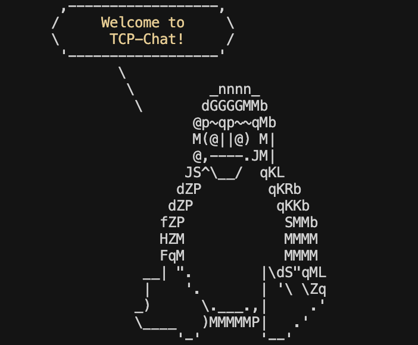

# TCP Chat



A command-line TCP chat server application that allows up to 10 clients to connect and communicate in a shared chat room.

## Features

- Multi-client support
- Real-time chat functionality
- Color-coded usernames with unique color selection
- Chat history tracking
- Idle timeout management
- Logging system
- Clean client disconnection handling
- Private messaging support
- Command-based interaction
- IP-based connection restriction (one connection per IP)

## Getting Started

### Prerequisites

For running the application:
- No special prerequisites needed - the executable for linux is provided

For building from source:
- Go (Golang) installed on your system

### Running the Server

You can run the server in several ways:

1. Using the provided executable without specifying a port (default port will be used):
```bash
./TCPChat
```

2. Using the provided executable with a specific port number:
```bash
./TCPChat [port]
```

3. Running from source code (requires Go installation):
```bash
go run .
```
or with a specific port:
```bash
go run . [port]
```

### Connecting to the Server

You can connect to the server using the `nc` (netcat) command:
```bash
nc <host ip> [port]
```

Note: Only one connection per IP address is allowed. Multiple connections from the same IP will be rejected.

## Usage

1. When you connect to the server, you will be prompted to enter your username
2. After username selection, you'll be asked to choose a unique color for your messages (each user must have a different color)
3. After successful login, you can start chatting with other connected users
4. Messages are broadcast to all connected clients
5. The server maintains a chat history
6. Inactive users will be automatically disconnected after a period of inactivity

### Available Commands

The chat supports several commands for enhanced interaction:

- `-h` or `--help`: Display help message with all available commands
- `-r [new_name]` or `--rename [new_name]`: Change your username
- `-c` or `--color`: Change your display color
- `-dm [username] [message]`: Send a private message to a specific user
- `-u` or `--users`: List all online users
- `-q` or `--quit`: Leave the chat

### Color System

- Each user must select a unique color upon joining
- Colors are used to distinguish between different users in the chat
- If a desired color is already taken, you'll need to choose a different one
- You can change your color later using the `-c` command
- Available colors will be displayed during selection

## Implementation Details

The application is built with the following components:

- Main server handler
- Client connection management
- Chat display and formatting
- User authentication
- Message history tracking
- Idle timeout checker
- Logging system
- Color management system
- Command processor

## Error Handling

The application includes robust error handling for:
- Invalid port numbers
- Connection issues
- Client disconnections
- Invalid usernames
- Duplicate colors
- Invalid commands
- Network errors
- Multiple connection attempts from same IP
- Connection limit enforcement

## Authors

- Irem ([@bytebabee](https://github.com/bytebabee)) 
- Taha ([@tcavuslu](https://github.com/tcavuslu)) 
- Thanos